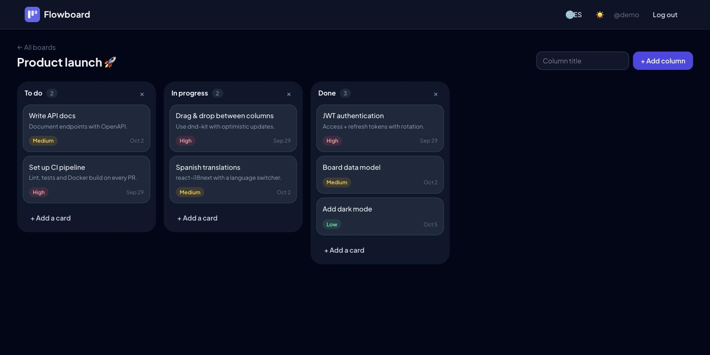

# Flowboard: Kanban Board

[](https://github.com/MigueIAngel/kanban-board/actions/workflows/ci.yml)


A full-stack Kanban board. The frontend is built with **React 19**, **TypeScript**, **dnd-kit** and **TanStack Query**, and the backend is a **Django REST Framework** API with **JWT** authentication. The UI is available in English and Spanish.



**Live demo:** https://kanban-board-demo.onrender.com (demo account `demo` / `kanban12345`) · [API docs](https://kanban-api-demo.onrender.com/api/docs/).

> Hosted on Render's free plan: the first request after a period of inactivity can take up to a minute while the service wakes up. Demo data is reset on every restart.

## Features

- **Drag & drop** cards within a column and across columns, with pointer and keyboard support (dnd-kit)
- **Optimistic updates**: the board updates instantly and rolls back if the API call fails
- Consistent ordering: a pure `moveCard` function on the client mirrors `Card.move()` on the server, which keeps positions dense and locks rows inside a transaction
- Boards, columns and cards: create, edit (title, description, priority, due date) and delete. Overdue cards are highlighted
- **JWT auth** with access and refresh tokens. The axios interceptor refreshes the token once for all parallel requests and retries them
- Ownership rules: users only see and modify their own boards. The rules live in querysets and serializer fields
- **i18n (EN/ES)** with language detection, plus **dark mode**
- OpenAPI docs at `/api/docs/`
- Tests: pytest for the API (ordering, ownership, auth) and Vitest + Testing Library for the UI
- Docker Compose setup: PostgreSQL, gunicorn, and nginx serving the SPA and proxying `/api`

## Architecture

```
┌──────────────┐   /api (same origin)   ┌────────────────────┐     ┌────────────┐
│ React SPA    │ ─────────────────────▶ │ Django REST (JWT)  │ ──▶ │ PostgreSQL │
│ nginx :8080  │                        │ gunicorn :8000     │     └────────────┘
└──────────────┘                        └────────────────────┘
```

| Layer | Tools |
|---|---|
| Frontend | React 19, TypeScript, Vite 8, Tailwind CSS 4, dnd-kit, TanStack Query, React Router 7, react-i18next, axios |
| Backend | Django 6.1, Django REST Framework, SimpleJWT, django-cors-headers, drf-spectacular |
| Data | PostgreSQL 16 (SQLite locally) |
| Quality | pytest, Vitest, Testing Library, Ruff, oxlint |
| DevOps | Docker, docker-compose, nginx, GitHub Actions |

## Getting started

### Docker

```bash
docker compose up --build
```

Open http://localhost:8080 and log in with **demo / kanban12345**. The login page has a button that fills these in.

### Local development

```bash
# Backend (http://localhost:8000)
cd backend
python -m venv .venv && source .venv/bin/activate
pip install -r requirements-dev.txt
python manage.py migrate && python manage.py seed_demo
python manage.py runserver

# Frontend (http://localhost:5173, proxies /api to :8000)
cd frontend
npm install
npm run dev
```

### Tests

```bash
cd backend && pytest
cd frontend && npm test
```

## API

| Method | Endpoint | Description |
|---|---|---|
| `POST` | `/api/auth/register/` | Create an account |
| `POST` | `/api/auth/token/` · `/api/auth/token/refresh/` | Obtain or refresh a JWT |
| `GET` | `/api/auth/me/` | Current user |
| `GET` `POST` | `/api/boards/` | List or create boards (new boards get default columns) |
| `GET` `PATCH` `DELETE` | `/api/boards/{id}/` | Board with its columns and cards |
| `POST` `PATCH` `DELETE` | `/api/columns/{id}/` | Manage columns |
| `POST` `PATCH` `DELETE` | `/api/cards/{id}/` | Manage cards |
| `POST` | `/api/cards/{id}/move/` | Move a card: `{ "column": 2, "position": 0 }` |

## Project structure

```
backend/
├── boards/            # models, serializers, viewsets, tests, seed_demo
└── config/            # settings (JWT, CORS, OpenAPI), urls
frontend/src/
├── api/               # axios client, token store, typed endpoints
├── auth/              # AuthProvider
├── board/             # KanbanBoard (dnd-kit), columns, cards, moveCard
├── components/        # layout, route guards, toolbar
├── i18n/              # en.json, es.json
└── pages/             # auth, boards, board
```

## License

MIT
